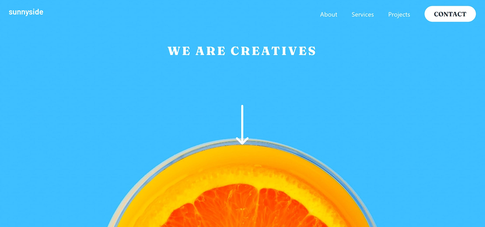

# Frontend Mentor - Sunnyside agency landing page solution

This is a solution to the [Sunnyside agency landing page challenge on Frontend Mentor](https://www.frontendmentor.io/challenges/sunnyside-agency-landing-page-7yVs3B6ef). Frontend Mentor challenges help you improve your coding skills by building realistic projects.

## Table of contents

- [Overview](#overview)
  - [The challenge](#the-challenge)
  - [Screenshot](#screenshot)
  - [Links](#links)
- [My process](#my-process)
  - [Built with](#built-with)
  - [What I learned](#what-i-learned)
  - [Continued development](#continued-development)
  - [Useful resources](#useful-resources)
- [Author](#author)
- [Acknowledgments](#acknowledgments)

## Overview

### The challenge

Users should be able to:

- View the optimal layout for the site depending on their device's screen size
- See hover states for all interactive elements on the page

### Screenshot



### Links

- Live Site URL: [omarmattia7.github.io](https://omarmattia7.github.io/frontend-mentor-challenges/10-sunnyside-landing)

## My process

### Built with

- React
- Typescript
- Tailwind CSS
- CSS Grid
- Mobile-first workflow

### Continued development

In my future projects I want to import all images in a single file and import them from there using webpack's ```require.context()```.

## Author

- Frontend Mentor - [@hazel79](https://www.frontendmentor.io/profile/hazel79)
- Twitter - [@OmarMAttia7](https://twitter.com/OmarMAttia7)

## Attributions

- Mockup by denamorado on Freepik (https://www.freepik.com/free-psd/digital-devices-screen-editable_32084754.htm#query=responsive%20website%20mockup&position=1&from_view=keyword)
